# CampusPulse – School Management Suite

**Odoo 19 · Version 19.0.2.0.0 · License LGPL-3**

Admissions, students, fees, attendance, exams, library, notices and a live dashboard — in one Odoo app.

**Author:** SmartDeskSolution  
**Website:** https://www.smartdesksolution.com  
**Email:** info@smartdesksolution.com

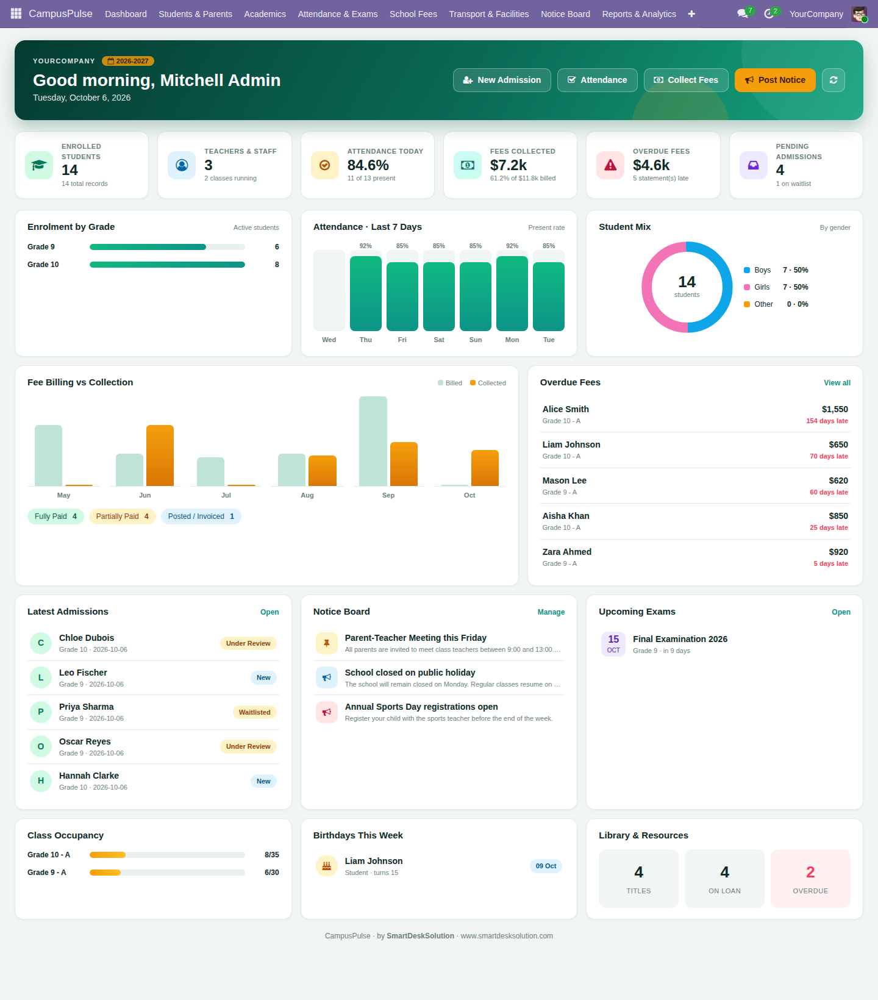

---

## Contents
1. [What's new in 2.0](#whats-new-in-20)
2. [Feature tour](#feature-tour)
3. [Installation](#installation)
4. [Quick start](#quick-start)
5. [Workflows](#workflows)
6. [Roles & access](#roles--access)
7. [Configuration](#configuration)
8. [Upgrading from 1.x](#upgrading-from-1x)
9. [Module structure](#module-structure)
10. [Support](#support)

## What's new in 2.0

**Added**
- New **dashboard** (Emerald & Gold theme): KPIs, enrolment, attendance trend, fee billing vs collection, overdue fees, admissions, notices, exams, birthdays, library.
- **Partial fee payments** with receipt numbers, payment history and an Overdue indicator.
- **Bulk fee generation** wizard (by fee structure and class).
- **Promotion / graduation wizard** with seat-capacity checks.
- **Exam workflow** (Draft → Ongoing → Completed), one-click **report-card generation**, class **rank**.
- **Notice board** (priority, pinning, expiry).
- **Conduct & achievements** log with a conduct score.
- **Library**: availability check, fines, renewals, daily overdue job.
- **Attendance**: Mark All Present, one register per class per day, reopen.
- **Admissions**: waitlist stage, reviewer and decision date, duplicate-student protection.

**Removed / replaced**
- Hostel management (blocks, rooms, allocations).
- One-click "Register Full Payment" → payment wizard.
- Student "Promoted" status → promotion wizard.
- Guardian annual-income field.
- Public website "My Fees" menu link.
- Separate analytics sub-menus → one **Reports & Analytics** menu.

**Fixed**
- The default `admin` user can use the app immediately after installation.

## Feature tour

| Screen | Preview |
|---|---|
| Admissions pipeline | 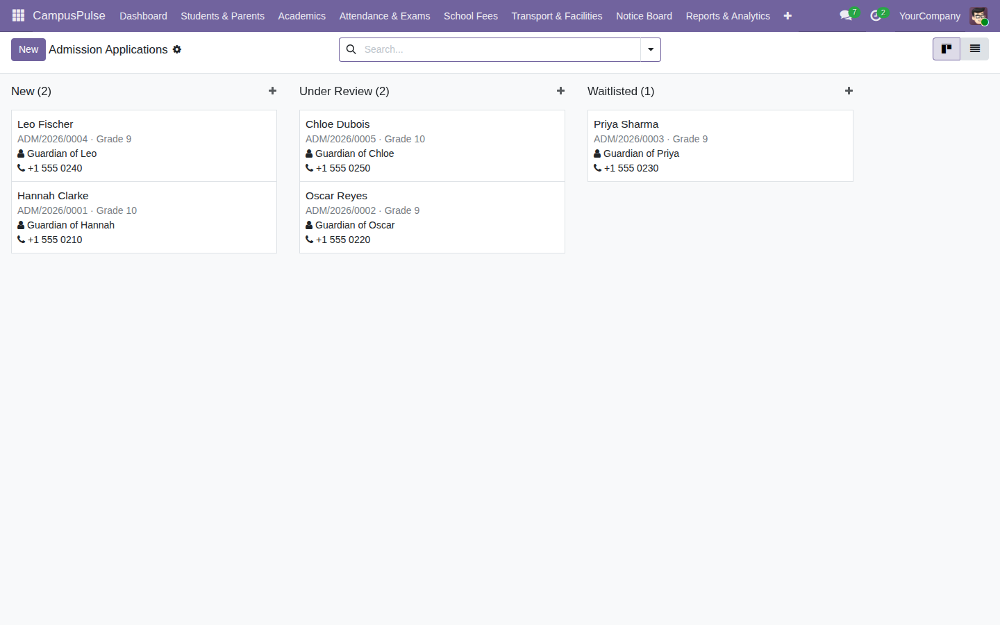 |
| Student profile | 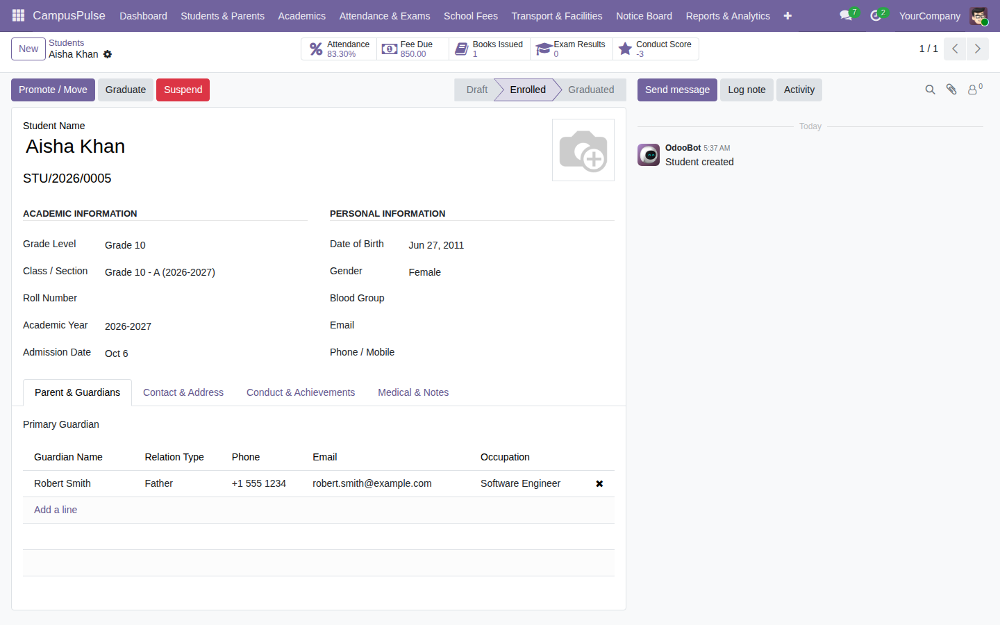 |
| Fee statement & payments | 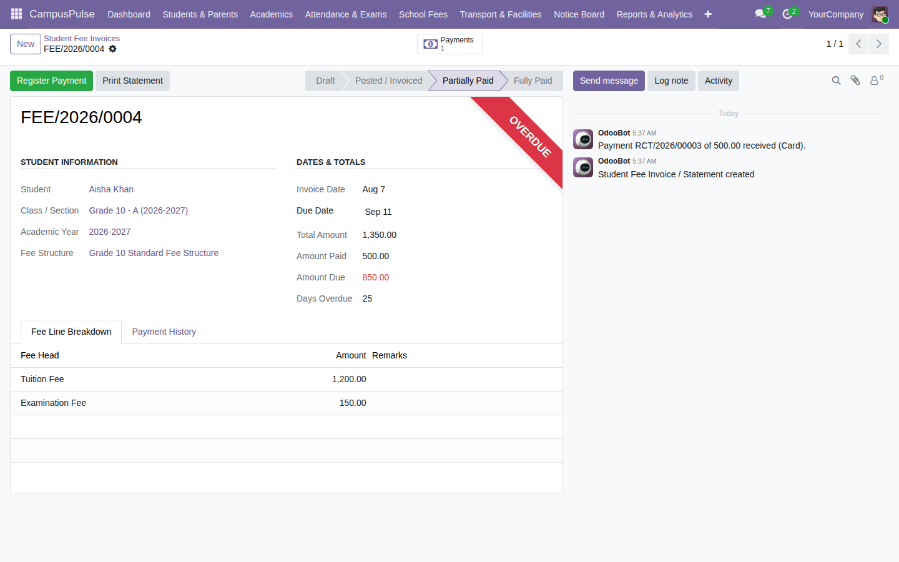 |
| Register payment | 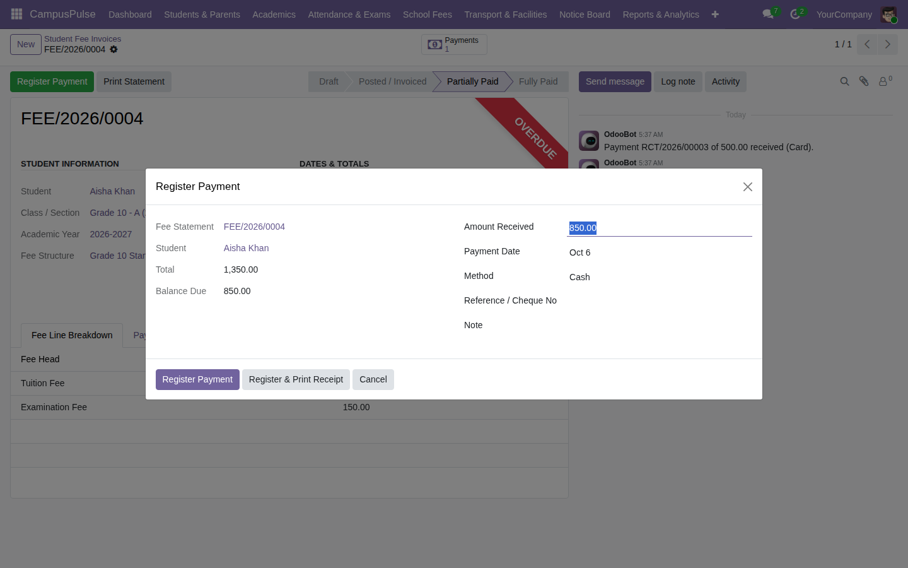 |
| Generate fees | 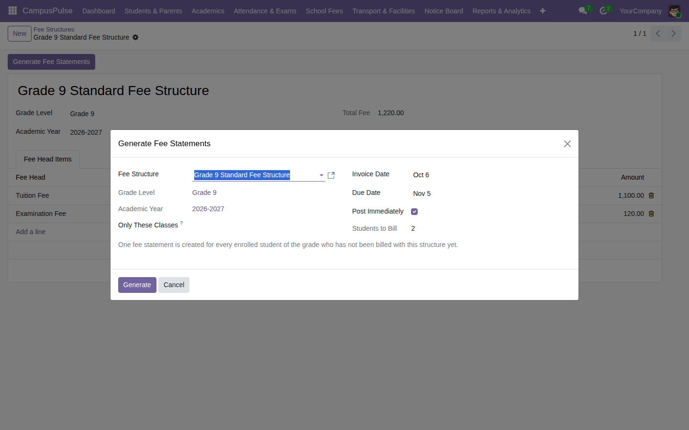 |
| Promote students | 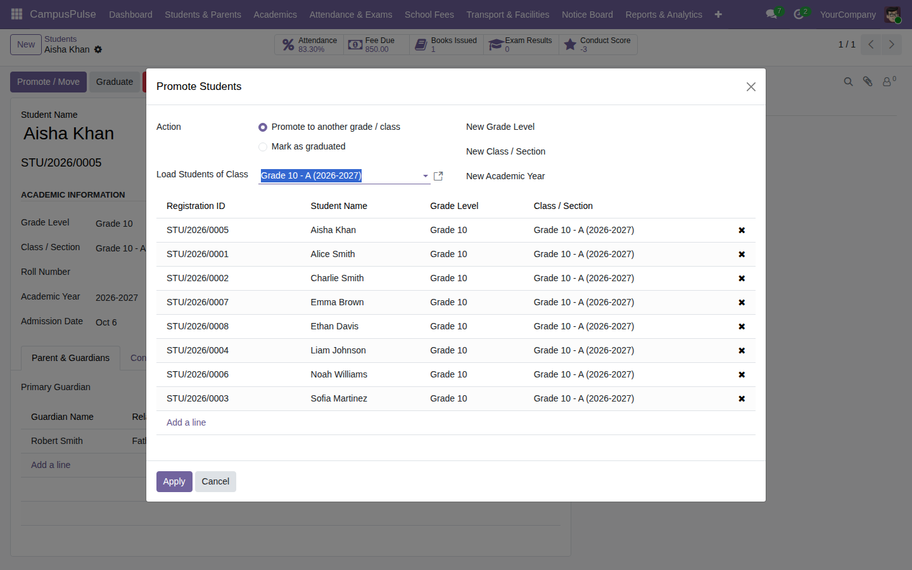 |
| Attendance | 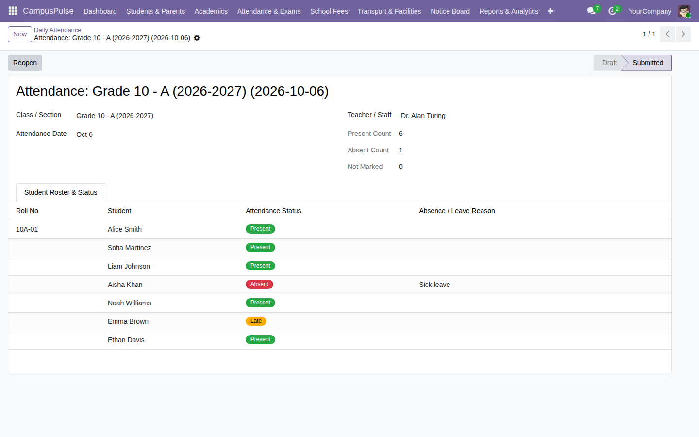 |
| Exams | 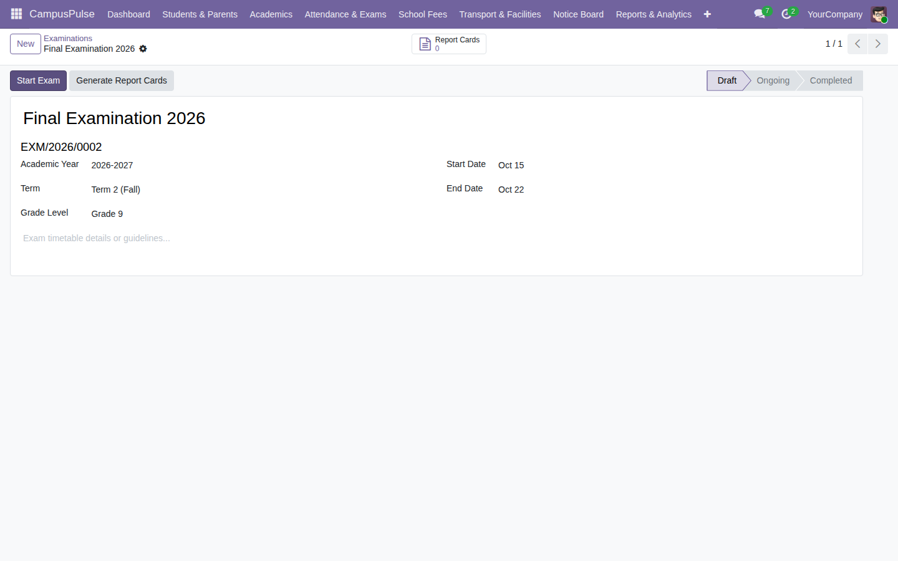 |
| Library | 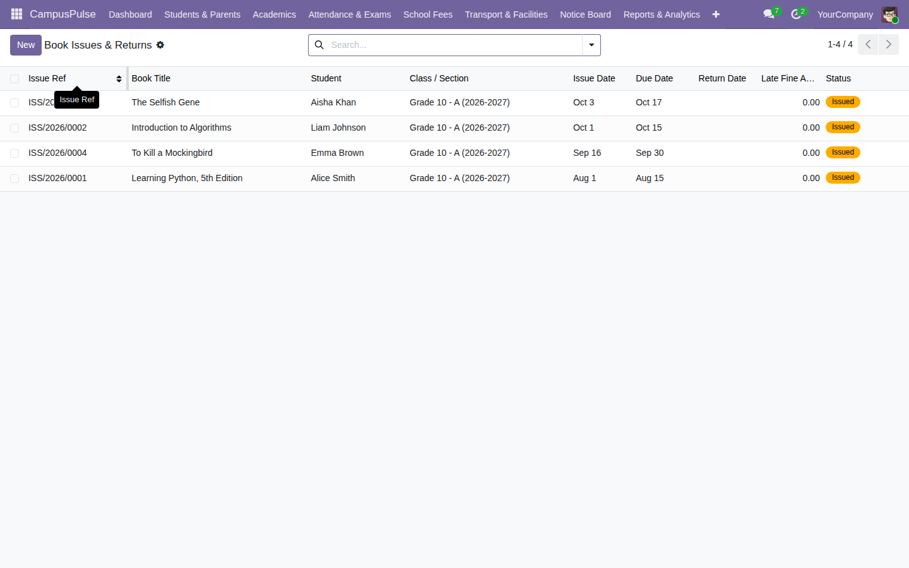 |
| Notices | 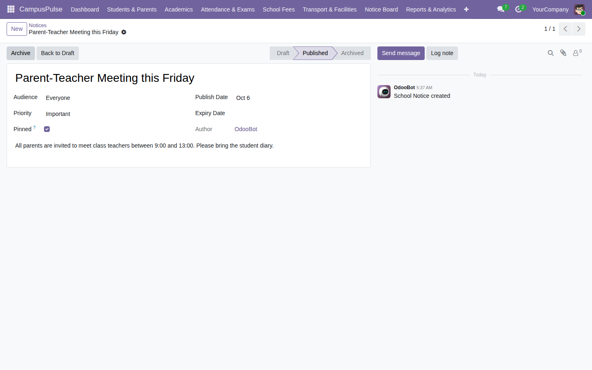 |
| Conduct | 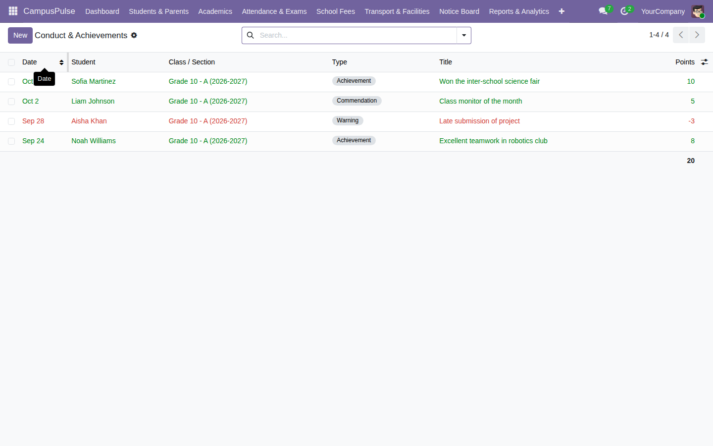 |
| Analytics | 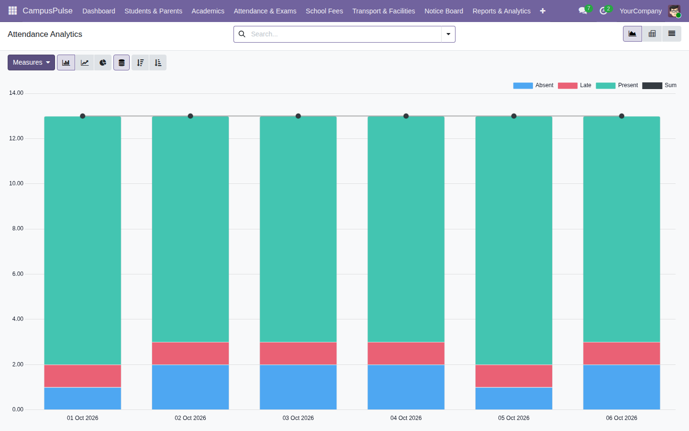 |

## Installation
1. Copy `SDS_school_management_system` into your Odoo addons path.
2. Restart Odoo and update the apps list (developer mode).
3. Install **CampusPulse – School Management Suite**.

Depends on: `base`, `mail`, `website`, `portal`.

## Quick start
1. **Configuration** → Academic Years, Grade Levels (with subjects), Grading Scale, Fee Categories.
2. Create **Classes & Sections** and **Teachers**.
3. **Admissions** → *Approve & Enrol* (or create students directly).
4. **School Fees** → create a Fee Structure → **Generate Fees** → open a statement → **Register Payment**.
5. **Attendance & Exams** → take attendance; create an exam → *Start* → *Generate Report Cards*.
6. Year-end: **Academics → Promote Students**.

## Workflows
- Admission: `New → Under Review → Waitlisted → Approved` (or `Rejected`)
- Fee statement: `Draft → Posted → Partially Paid → Fully Paid` (or `Cancelled`)
- Exam: `Draft → Ongoing → Completed`
- Library loan: `Issued → Overdue (automatic) → Returned`
- Student: `Draft → Enrolled → Suspended / Graduated`

## Roles & access
| Role | Group | Access |
|---|---|---|
| Administrator | School / Administrator | Full access, fees & payments, wizards |
| Teacher | School / Teacher or Faculty | Attendance, exams, library, conduct; read-only fees |
| Parent | Portal user | Own children's attendance, results, fees; online admission form |

## Configuration
| Setting | Location | Default |
|---|---|---|
| Library fine per late day | System Parameter `school.library_fine_per_day` | `1.0` |
| Overdue loan job | Scheduled action *School: flag overdue library loans* | daily |

## Upgrading from 1.x
```bash
odoo-bin -u SDS_school_management_system -d YOUR_DB
```
- Technical name is unchanged, so the upgrade happens in place.
- "Promoted" students become "Enrolled" automatically.
- Hostel tables (`school_hostel_*`) are **not** dropped; remove them manually if unneeded.

## Module structure
```
SDS_school_management_system/
├── models/        # business logic (fee payments, dashboard data, notices, conduct, ...)
├── wizard/        # payment, bulk fee generation, promotion
├── views/         # backend views, menus, portal templates
├── report/        # PDF reports (fee statement, report card, ID card)
├── security/      # groups and access rules
├── data/          # sequences, cron, parameters
├── demo/          # demo data
├── migrations/    # 19.0.2.0.0 upgrade script
├── controllers/   # portal & admission form
└── static/
    ├── src/       # dashboard (OWL, SCSS) and portal CSS
    └── description/  # icon, banner, documentation page and screenshots
```

## Support
SmartDeskSolution · https://www.smartdesksolution.com · info@smartdesksolution.com
